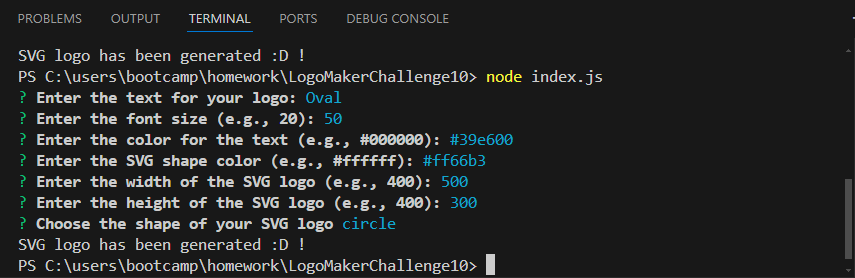
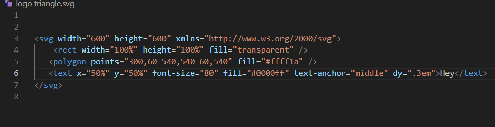

# LogoMakerChallenge10
Generates SVG logos.

# Introduction
A simple to use SVG logo maker.

# Usage
A single .js file program to create SVG logo's quickly for use.

# Installation
Requires NPM Inquirer, and NPM Jest, other than that, the program is used right in Node JS

# How to use
1: open the proper folder with the directory that matches the one in the image below.
2: enter node index.js in the terminal to being the program.
3: fill out the question prompts for the design of the SVG logo shape, text, and color.
4: when finished a logo.svg file will appear in the file/folders section, rename the file if you would like to proceed with making more, as keeping the name will result in it being overwritten if you proceed to create a new svg logo via 'node index.js'
5: to view the actual visual of the logo, right click on the logo file name, and open using Open With Live Server.

# Links
GitHub Repository.
https://github.com/ConnorLuks/LogoMakerChallenge10

How to use video.
https://1drv.ms/v/c/0d7c60f6f050fa73/ESGs7ix5_itPpJf4kCs0maYBHw-k2Mi7OBlGolRv9TkRYQ?e=OtVfdd

# Photos
node instructions

SVG logo data output for triangle

# License
Distributed under the MIT license.

# Credits
Connor O'Halloran.
and W3.org